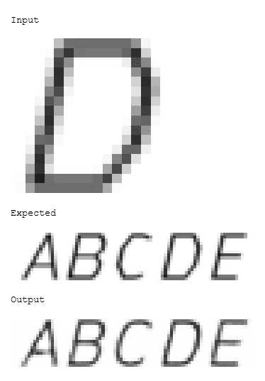
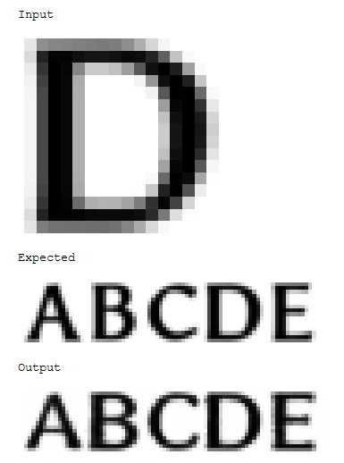
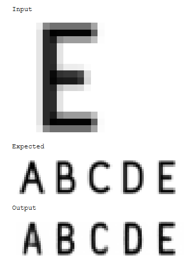
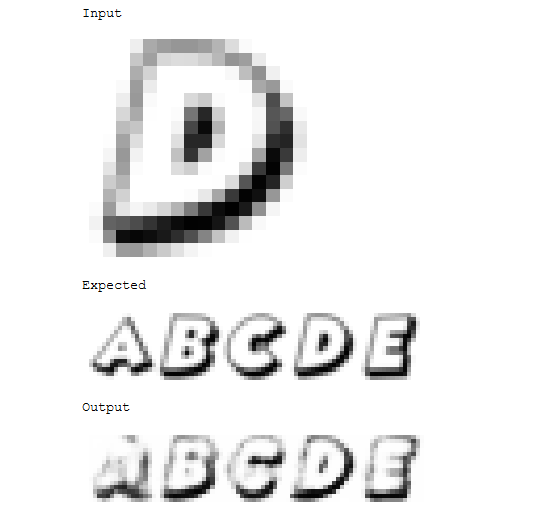

# StyledFontGAN
The original intent of this project was to create a generative adversarial network that, given a single image of a letter, will generate the remaining characters in the alphabet (A-Z.)

## Motivation Behind This Project
This is a simple project that I've been using to teach myself all about GANs, and getting familiar with Python. I don't claim to be talented when it comes to machine learning, but I want to understand it's capabilities and the challenges that can arise.

Please note that this is a side project, and not academic research. Ultimately, the goal is to apply this to non-latin alphabets where producing fonts are extremely time consuming.

## Prior Work and Acknowledgements

A lot of this project is inspired by the following research papers and their associated code:

- [MC-GAN](https://github.com/azadis/MC-GAN) - Multi-Content GAN for Few-Shot Font Style Transfer; Samaneh Azadi, Matthew Fisher, Vladimir Kim, Zhaowen Wang, Eli Shechtman, Trevor Darrell, in arXiv, 2017.
- [GlyphGAN](https://arxiv.org/abs/1905.12502v1) - GlyphGAN: Style-Consistent Font Generation Based on Generative Adversarial Networks; Hideaki Hayashi, Kohtaro Abe, Seiichi Uchida, in arXiv, 2019
- [DC-GAN](https://arxiv.org/abs/1511.06434) - Unsupervised Representation Learning with Deep Convolutional Generative Adversarial Networks; Alec Radford, Luke Metz, Soumith Chintala, in arXiv, 2016
- [WGAN-GP](https://arxiv.org/abs/1704.00028) - Improved Training of Wasserstein GANs; Ishaan Gulrajani, Faruk Ahmed, Martin Arjovsky, Vincent Dumoulin, Aaron Courville, in arXiv, 2017

- Some pieces of code, specifically the `Flatten` and `Unflatten` methods were pulled from the [CS231N course](https://cs231n.github.io/) samples.

This project was made possible by this research and the contributions made by the above authors. Thank you.

## Architecture

The most succcessful model has been trained with the following generator and discriminators, and using an **L1 Loss** for the Generator, and the loss from **WGAN-GP** (Wasserstein Distance + Gradiant Penality) for the Discriminator.

### Generator Architecture

The thought process behind this network architecture is not well informed. The inuition is that we take an image, extract its features with Conv layers, turn it into some intermediate format within the Linear layers, then use that intermediate format to generate a new image using the ConvTranspose layers.

The result is good, but it's not ideal. Currently working on identifying what layers are actually contributing and determining if there are layers that are unnecessary.

```
Sequential(
  (0): Conv2d(1, 1024, kernel_size=(4, 4), stride=(2, 2), padding=(1, 1))
  (1): LeakyReLU(negative_slope=0.2)
  (2): Conv2d(1024, 512, kernel_size=(4, 4), stride=(2, 2), padding=(1, 1))
  (3): LeakyReLU(negative_slope=0.2)
  (4): Conv2d(512, 256, kernel_size=(4, 4), stride=(2, 2), padding=(1, 1))
  (5): LeakyReLU(negative_slope=0.2)
  (6): Flatten()
  (7): Linear(in_features=1024, out_features=256, bias=True)
  (8): ReLU()
  (9): Linear(in_features=256, out_features=5120, bias=True)
  (10): ReLU()
  (11): Unflatten()
  (12): BatchNorm2d(256, eps=1e-05, momentum=0.1, affine=True, track_running_stats=True)
  (13): ConvTranspose2d(256, 128, kernel_size=(4, 4), stride=(2, 2), padding=(1, 1))
  (14): BatchNorm2d(128, eps=1e-05, momentum=0.1, affine=True, track_running_stats=True)
  (15): ReLU()
  (16): ConvTranspose2d(128, 64, kernel_size=(4, 4), stride=(2, 2), padding=(1, 1))
  (17): BatchNorm2d(64, eps=1e-05, momentum=0.1, affine=True, track_running_stats=True)
  (18): ReLU()
  (19): ConvTranspose2d(64, 1, kernel_size=(4, 4), stride=(2, 2), padding=(1, 1))
  (20): Sigmoid()
)
```

### Discriminator Architecture

This follows DC-GAN. No magic, or added things here. As with the linked papers from above, we do not apply batch normalization which helps with training.

```
(Sequential(
   (0): Conv2d(1, 16, kernel_size=(4, 4), stride=(2, 2), padding=(1, 1))
   (1): LeakyReLU(negative_slope=0.2)
   (2): Conv2d(16, 32, kernel_size=(4, 4), stride=(2, 2), padding=(1, 1))
   (3): LeakyReLU(negative_slope=0.2)
   (4): Conv2d(32, 64, kernel_size=(4, 4), stride=(2, 2), padding=(1, 1))
   (5): LeakyReLU(negative_slope=0.2)
   (6): Conv2d(64, 128, kernel_size=(4, 4), stride=(2, 2), padding=(1, 1))
   (7): LeakyReLU(negative_slope=0.2)
   (8): Flatten()
   (9): Linear(in_features=640, out_features=1, bias=True)
   (10): Sigmoid()
 ),
```

## Results

This was by no means an academic study nor was it an attempt to push the boundaries of current research, but the results were good.

This project used the data set from [MC-GAN](https://github.com/azadis/MC-GAN) which uses a variety of different fonts and samples. In some cases, the samples are all uppercase letters, while as others are a mix of uppercase and lowercase letters.

### Samples

#### Successes
In these examples, the results are both legible and match the original style.







### Questionable Failures

The network succeeded in capturing the style, with the dark shadows, but couldn't produce legible letters.


The letters aren't very clear, but despite the strange style, it seems to have respected it.

### Failures

The network failed to produce legible letters, and failed to copy the style.

### Conclusions
TBD

## Setup

1. Install `pytorch`: https://pytorch.org/get-started/locally/
2. For now, you will also need a tool to view notebooks. I use Jupyter.
3.
3. Dependencies: TBD
